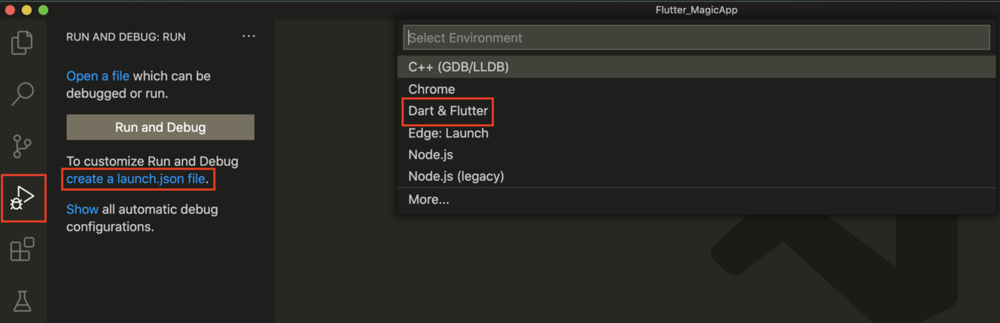
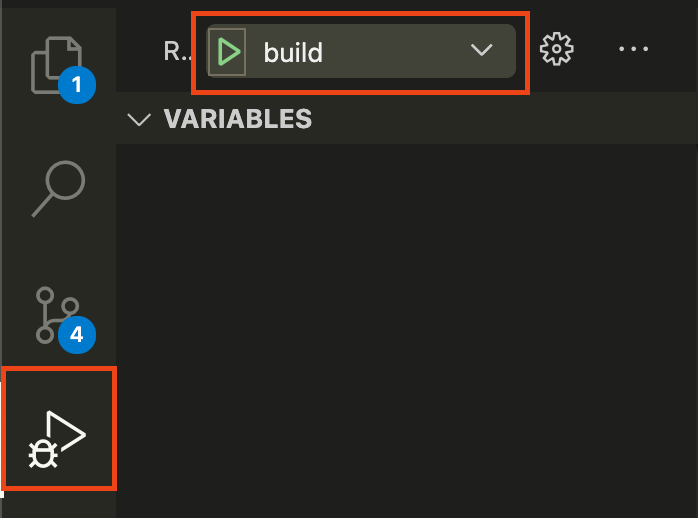
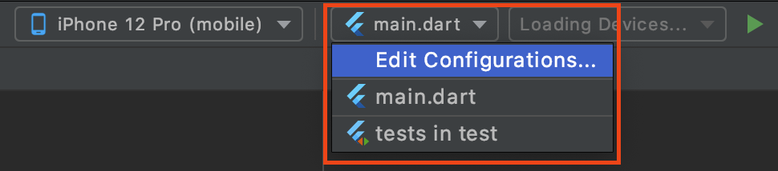

# Flutter Movies App
[](https://pub.dev/packages/lint) 
[](https://codecov.io/gh/concretesolutions/flutter-moviesapp) 
[](https://github.com/concretesolutions/flutter-moviesapp/actions/workflows/CI.yml)


# Pesquisa & Desenvolvimento
Este repositório é utilizado pelo time de Flutter do projeto de Pesquisa e Desenvolvimento para validar essa tecnologia.

O objetivo principal desse time na iniciativa é validar como o Flutter está preparado para os padrões de engenharia sólida que a Concrete busca nos produtos que desenvolvemos.

## Engenharia 
Alguns tópicos que foram validados com relação ao Flutter foram:
* **CI:** A criação de uma CI com o Github Actions foi simples e rápida.
* **Arquitetura:** A arquitetura utilizada foi o MVVM e se provou ser uma arquitetura válida, assim como ela costuma ser para outras tecnologias mobile.
* **Testes:** A criação de testes foi simples devido a grande quantidade de códigos prontos que auxiliam na escrita. Entretando, o log de testes que falham é ruim e de díficil entendimento.
* **Métricas:** Para avaliar a qualidade do produto desenvolvido foi possível gerar relatórios de cobertura e validações de lint.

## Produto Desenvolvido
O produto desenvolvido foi o aplicativo Movies.

Este aplicativo é utilizado como o desafio técnico mobile da empresa.

O aplicativo consiste em Listar filmes da API do [TheMovieDB](https://www.themoviedb.org/?language=en) e criar uma lista de filmes favoritos.

### Aplicativo
<table>
  <tr>
    <td style='text-align:center; vertical-align:middle'>Android</td>
     <td style='text-align:center; vertical-align:middle'>iOS</td>
     <td style='text-align:center; vertical-align:middle'>Web</td>
  </tr>
  <tr>
    <td></td>
    <td></td>
    <td></td>
  </tr>
 </table>

## Executando o projeto
Um pré requisito para executar o projeto é possuir o Flutter instalado corretamente. É possível validar a instalação pelo seguinte comando.

```
$ flutter doctor
```

Com o flutter instalado corretamente é preciso realizar mais uma configuração para que seja possível executar o projeto. Para essa configuração será necessário ter uma `APIKey` da API do [TheMovieDB](https://www.themoviedb.org/?language=en). 

Para gerar ela acesse o seguinte link e siga as instruções:

[TheMovieDB API](https://developers.themoviedb.org/3/getting-started/introduction)

### VSCode
Caso esteja utilizando o VSCode é preciso criar uma *launch configuration*.

Com o projeto aberto no VSCode é possível adicionar uma launch configuration ao ir na aba "Run and Debug", clicando em "create a launch.json file" e por fim selecionando a opção "Dart & Flutter".



Após criar a configuração, substitua seu conteúdo pelo seguinte snippet, alterando apenas o valor da APIKey para a que foi gerada.

```json
{
    "version": "0.2.0",
    "configurations": [
        {
            "name": "build",
            "type": "dart",
            "request": "launch",
            "program": "lib/main.dart",
            "args": [
                "--dart-define", "APIKEY=<SUA API KEY>"
            ],
        },
    ]
}
```
Com a configuração feita, basta executar ela clicando na aba "Run and Debug" e, em seguida, no botão de play com o nome *build*.




### Android Studio
Caso esteja utilizando o Android Studio é preciso modificar a configuração de execução.

Para isso clique na configuração "main.dart" e em seguida em "Edit Configurations...".



Após abrir a configuração, adicione o seguinte valor no campo "Additional arguments" e clique em "Apply" e em seguida em "OK".

```
--dart-define=APIKEY=<SUA API KEY>
```

Com a configuração feita, basta executar ela clicando no botão de play.

### Terminal
Para executar o projeto pelo terminal basta utilizar a *flag* `--dart-define` com a APIKey.

```
flutter run --dart-define=APIKEY=<SUA API KEY>
```